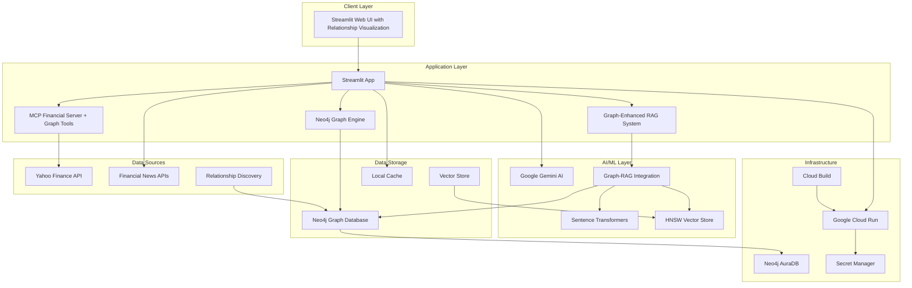

# Financial Advisor Application - Design Document

## Table of Contents
1. [Executive Summary](#executive-summary)
2. [System Overview](#system-overview)
3. [Architecture](#architecture)
4. [Core Components](#core-components)
5. [Data Flow](#data-flow)
6. [Technology Stack](#technology-stack)
7. [Security Architecture](#security-architecture)
8. [Deployment Architecture](#deployment-architecture)
9. [Performance Considerations](#performance-considerations)
10. [Future Enhancements](#future-enhancements)

---

## Executive Summary

The Financial Advisor Application is an intelligent stock portfolio management and trading advisor system that combines real-time financial data analysis with advanced AI capabilities and Neo4j knowledge graphs. The application leverages state-of-the-art technologies including Neo4j Graph Database, Graph-Enhanced Retrieval-Augmented Generation (RAG), and the Model Context Protocol (MCP) to provide comprehensive financial insights with relationship-aware analysis.

### Key Features
- **Real-time Stock Analysis**: Live market data visualization and technical analysis
- **AI-Powered Insights**: Intelligent analysis using Google's Gemini LLM with graph-enhanced context
- **Neo4j Knowledge Graph**: Company relationship mapping and network analysis
- **Graph-Enhanced RAG System**: Context-aware information retrieval with multi-hop relationship expansion
- **Portfolio Correlation Analysis**: Hidden risk identification through relationship networks
- **Market Influence Networks**: Visualization of how events propagate through connected companies
- **Supply Chain Risk Assessment**: Dependency vulnerability analysis
- **Financial Statement Analysis**: Comprehensive evaluation of company financials
- **News Impact Propagation**: Real-time financial news with relationship-aware impact analysis
- **Multi-format Export**: Data export capabilities in CSV, JSON, and Excel formats

---

## System Overview

### Purpose
The system aims to democratize financial analysis by providing institutional-grade analytical capabilities to individual investors and traders. It combines multiple data sources with AI to deliver actionable insights.

### Target Users
1. **Individual Investors**: Making informed investment decisions with relationship-aware risk analysis
2. **Day Traders**: Real-time technical analysis and market monitoring with network insights
3. **Financial Analysts**: Comprehensive company research with supply chain and competitive intelligence
4. **Portfolio Managers**: Multi-stock portfolio tracking with correlation analysis and systemic risk assessment
5. **Risk Managers**: Portfolio relationship analysis and hidden correlation discovery
6. **Research Teams**: Market network analysis and cross-company impact assessment

### Core Capabilities
- **Data Aggregation**: Unified view of stock prices, financials, news, and relationship networks
- **Graph-Enhanced Analysis**: AI-driven insights with relationship-aware RAG enhancement
- **Network Discovery**: Multi-hop relationship traversal and pattern recognition
- **Risk Correlation**: Portfolio-wide relationship analysis and systemic risk identification
- **Interactive Visualization**: Real-time charts and technical indicators
- **Knowledge Management**: Semantic search across financial documents

---

## Architecture

### High-Level Architecture



### Component Architecture

#### 1. **Presentation Layer**
- **Streamlit UI**: Multi-tab interface for different analysis views
- **Interactive Charts**: Plotly-based visualizations
- **Real-time Updates**: WebSocket-based data streaming

#### 2. **Business Logic Layer**
- **Financial Analysis Engine**: Technical indicators and metrics calculation
- **Graph Relationship Engine**: Company network analysis and correlation discovery
- **AI Chat Interface**: Natural language query processing with graph-enhanced context
- **Data Processing Pipeline**: ETL for financial data and relationship extraction

#### 3. **Data Access Layer**
- **MCP Server**: Standardized financial data access with graph database tools
- **Neo4j Graph Database**: Relationship storage and network analysis
- **Graph-Enhanced RAG**: Semantic search with multi-hop relationship expansion
- **Cache Management**: TTL-based caching for both data and relationships

#### 4. **AI/ML Layer**
- **LLM Integration**: Gemini AI for analysis with relationship context
- **Embedding Generation**: Sentence transformers for semantic understanding
- **Vector Search**: HNSW indexing for similarity search
- **Graph-RAG Integration**: Relationship-aware context generation

---

## Core Components

### 1. Streamlit Application (`streamlit_app.py`)

The main user interface providing:

- **Multi-tab Layout**:
  - AI Chat: Interactive financial analysis with graph-enhanced insights
  - Chart View: Candlestick charts with volume and relationship indicators
  - Data Table: Historical price data with correlation metrics
  - Statistics: Technical analysis metrics and network statistics
  - Financial Statements: Company financials with peer comparisons
  - News: Latest financial news with impact propagation analysis
  - **Relationships**: Company network visualization and portfolio correlation analysis
  - Export: Data download options including relationship data

- **Session State Management**:
  ```python
  st.session_state = {
      'stock_data': DataFrame,
      'stock_info': Dict,
      'chat_history': List[Dict],
      'current_symbol': str,
      'financial_statements': Dict[str, DataFrame]
  }
  ```

### 2. MCP Financial Server (`src/mcp_financial_server/`)

Provides structured access to financial data:

- **Available Tools**:
  - `get_stock_history`: Historical price data with configurable periods
  - `get_stock_info`: Company information and metrics
  - `get_stock_quote`: Real-time stock quotes
  - `get_news`: Financial news aggregation

- **Protocol Implementation**:
  ```python
  @server.list_tools()
  async def list_tools() -> list[Tool]:
      return [stock_history_tool, stock_info_tool, 
              stock_quote_tool, news_tool]
  ```

### 3. RAG System (`src/rag_system.py`)

Advanced information retrieval system:

- **Components**:
  - **Semantic Chunker**: Coherence-based text segmentation
  - **HNSW Vector Store**: Efficient similarity search
  - **Query Rewriter**: Financial domain query expansion
  - **Hybrid Retriever**: Combined vector + keyword search
  - **Cross-encoder Reranker**: Relevance optimization
  - **Autocut Generator**: Dynamic context selection

- **Indexing Pipeline**:
  ```python
  def index_financial_data(data, company_symbol, data_type):
      chunks = semantic_chunk(data)
      embeddings = generate_embeddings(chunks)
      vector_store.add(embeddings, chunks)
      keyword_index.update(chunks)
  ```

### 4. Neo4j Graph Database (`src/neo4j_client.py`)

- **Graph Schema**:
  - **Node Types**: Company, Person, Sector, Industry, NewsEvent, Market, Country
  - **Relationship Types**: OWNS, SUPPLIES, COMPETES_WITH, CORRELATED_WITH, AFFECTS, BELONGS_TO
  - **Properties**: Strength metrics, timestamps, confidence scores

- **Core Operations**:
  ```python
  class FinancialGraphDB:
      def create_company(self, company_data) -> bool
      def create_relationship(self, from_symbol, to_symbol, rel_type, properties) -> bool
      def find_related_companies(self, symbol, max_hops=2) -> List[Dict]
      def analyze_portfolio_correlations(self, symbols) -> List[Dict]
      def get_market_influence_network(self, symbol, depth=2) -> Dict
      def find_supply_chain_risk(self, symbol) -> List[Dict]
  ```

- **Performance Optimization**:
  - Strategic indexing on symbol, sector, and date fields
  - Query optimization with relationship depth limits
  - Caching layer for frequently accessed relationships
  - Graceful degradation when Neo4j is unavailable

### 5. Graph-Enhanced RAG System (`src/rag_graph_integration.py`)

- **Enhanced Context Generation**:
  - Relationship-aware query expansion
  - Multi-hop relationship traversal for context
  - Cross-entity correlation analysis
  - Supply chain and competitive intelligence integration

- **Query Enhancement Strategies**:
  ```python
  class GraphEnhancedRAG:
      def expand_query_with_relationships(self, query, symbol) -> List[str]
      def get_relationship_context(self, symbol) -> str
      def enhanced_retrieval(self, query, symbol, k=10) -> Dict
  ```

### 6. AI Integration

- **Gemini LLM Configuration**:
  - Model: `gemini-1.5-flash`
  - Context window: 1M tokens
  - Temperature: 0.7 for balanced creativity
  - **Graph-enhanced prompts** with relationship context

- **Prompt Engineering**:
  - Structured analysis framework
  - Financial domain expertise
  - **Graph-enhanced RAG context injection**
  - Relationship-aware insight generation

---

## Data Flow

### 1. Data Ingestion Flow
```
User Input → Stock Symbol → MCP Server → Yahoo Finance API
                                     ↓
                              Stock Data/Info
                                     ↓
                            Streamlit Session State
                                     ↓
                              RAG Indexing
```

### 2. Query Processing Flow
```
User Question → Query Rewriter → Multiple Query Variants
                                          ↓
                                   Hybrid Search
                                          ↓
                                 Semantic Matching (HNSW)
                                 Keyword Matching (BM25)
                                          ↓
                                     Reranking
                                          ↓
                                 Context Selection
                                          ↓
                                  LLM Processing
                                          ↓
                                 Enhanced Response
```

### 3. Real-time Update Flow
```
Market Data → Yahoo Finance → Cache Check → Update UI
                                   ↓
                            5-minute TTL
                                   ↓
                           Refresh if Expired
```

---

## Technology Stack

### Frontend
- **Streamlit 1.28+**: Web application framework
- **Plotly 5.17+**: Interactive charting
- **HTML/CSS**: Custom styling

### Backend
- **Python 3.11**: Core language
- **FastAPI**: MCP server implementation
- **Pandas 2.0+**: Data manipulation
- **NumPy 1.24+**: Numerical computing

### Graph Database
- **Neo4j 5.13+**: Knowledge graph storage and querying
- **py2neo 2021.2+**: Alternative Neo4j client library
- **Cypher**: Graph query language
- **APOC**: Neo4j procedures for advanced graph algorithms

### AI/ML
- **Google Gemini**: Primary LLM with graph-enhanced context
- **Sentence Transformers**: Text embeddings for semantic search
- **HNSW (hnswlib)**: Vector indexing for similarity search
- **FAISS**: Alternative vector database option
- **scikit-learn**: ML utilities and correlation analysis
- **NLTK/spaCy**: NLP processing for relationship extraction

### Data Sources
- **yfinance 0.2.18+**: Yahoo Finance integration
- **BeautifulSoup4**: Web scraping for news and relationship data
- **requests**: HTTP client for external APIs
- **Relationship Discovery APIs**: Supply chain and competitive intelligence

### Infrastructure
- **Docker & Docker Compose**: Containerization with Neo4j stack
- **Neo4j AuraDB**: Managed Neo4j cloud service for production
- **Google Cloud Run**: Serverless deployment
- **Cloud Build**: CI/CD pipeline
- **Secret Manager**: Secure credential storage

---

## Security Architecture

### 1. Authentication & Authorization
- **API Key Management**: 
  - Google AI API keys in Secret Manager
  - Environment variable injection at runtime
  - No hardcoded credentials

### 2. Data Security
- **In-Transit**: HTTPS for all external communications
- **At-Rest**: Ephemeral storage in Cloud Run
- **Cache Security**: Session-isolated data

### 3. Application Security
- **Input Validation**: Symbol sanitization
- **XSS Prevention**: Streamlit's built-in protections
- **Rate Limiting**: Cloud Run concurrency controls

### 4. Deployment Security
- **Non-root Container**: Dedicated user execution
- **Least Privilege**: Minimal IAM permissions
- **Network Isolation**: VPC-native deployment

---

## Deployment Architecture

### Cloud Run Configuration
```yaml
Resources:
  CPU: 2 cores
  Memory: 4Gi
  
Scaling:
  Min Instances: 0
  Max Instances: 10
  Concurrency: 10
  
Environment:
  Execution: Gen2
  CPU Throttling: Disabled
  Timeout: 300s
```

### CI/CD Pipeline
1. **Source Control**: GitHub repository
2. **Build Trigger**: Push to main branch
3. **Cloud Build**: 
   - Docker image creation
   - ML model caching
   - Container registry push
4. **Deployment**: Automatic Cloud Run update
5. **Health Checks**: Liveness and readiness probes

### Multi-Region Deployment (Future)
```
US-Central1 (Primary) ←→ Load Balancer ←→ US-East1 (Secondary)
                              ↓
                         Europe-West1
```

---

## Performance Considerations

### 1. Caching Strategy
- **Data Cache**: 5-minute TTL for market data
- **Model Cache**: Pre-loaded ML models in Docker image
- **RAG Cache**: Persistent index storage (when enabled)

### 2. Optimization Techniques
- **Lazy Loading**: On-demand data fetching
- **Streaming**: Incremental UI updates
- **Batch Processing**: Grouped API calls
- **Vector Quantization**: Reduced embedding size

### 3. Scalability Metrics
- **Response Time**: <2s for standard queries
- **Throughput**: 100+ concurrent users
- **Memory Usage**: ~2GB baseline, 4GB peak
- **Cold Start**: <30s with model pre-loading

### 4. Performance Monitoring
- **Application Metrics**: Response times, error rates
- **Resource Metrics**: CPU, memory utilization
- **Custom Metrics**: RAG performance, cache hit rates

---

## Future Enhancements

### Phase 1: Enhanced Analytics (Q1 2025)
- [ ] Technical indicators library expansion
- [ ] Portfolio optimization algorithms
- [ ] Risk assessment models
- [ ] Backtesting framework

### Phase 2: Advanced Graph Features (Q2 2025)
- [ ] **Advanced Graph Analytics**: Graph algorithms for centrality, clustering, and community detection
- [ ] **Automated Relationship Discovery**: ML-powered relationship extraction from news and filings
- [ ] **Temporal Graph Analysis**: Time-series analysis of relationship evolution
- [ ] **Graph Visualization**: Interactive network diagrams and relationship maps
- [ ] **Risk Propagation Modeling**: Monte Carlo simulation of risk through relationships

### Phase 3: Enhanced AI & Platform Expansion (Q3 2025)
- [ ] **Multi-modal Analysis**: Charts + text + graph analysis
- [ ] **Graph-Enhanced Sentiment Analysis**: Relationship-aware news impact analysis
- [ ] **Predictive Relationship Modeling**: ML models for relationship strength prediction
- [ ] **Mobile Application**: With simplified graph visualization
- [ ] **REST API**: Graph database queries and relationship analysis endpoints
- [ ] **Real-time Graph Updates**: Live relationship monitoring and alerts

### Phase 4: Enterprise Graph Features (Q4 2025)
- [ ] **Multi-tenant Graph Database**: Isolated relationship networks per organization
- [ ] **Custom Relationship Types**: User-defined relationship categories and properties
- [ ] **Graph Data Governance**: Relationship audit trails and data lineage
- [ ] **Advanced Compliance**: Regulatory relationship monitoring and reporting
- [ ] **Graph-based Portfolio Optimization**: Network-aware portfolio construction

### Technical Debt Reduction
- [ ] Comprehensive test coverage (including graph database integration tests)
- [ ] Performance profiling (graph query optimization)
- [ ] Documentation automation
- [ ] Monitoring enhancement (graph database health and performance metrics)
- [ ] **Graph Database Optimization**: Query performance tuning and index optimization
- [ ] **Relationship Data Quality**: Automated validation and cleanup of graph relationships

---

## Appendices

### A. Database Schema (Future)
```sql
-- Users table
CREATE TABLE users (
    id UUID PRIMARY KEY,
    email VARCHAR(255) UNIQUE,
    created_at TIMESTAMP
);

-- Portfolios table
CREATE TABLE portfolios (
    id UUID PRIMARY KEY,
    user_id UUID REFERENCES users(id),
    name VARCHAR(255),
    created_at TIMESTAMP
);

-- Watchlists table
CREATE TABLE watchlists (
    id UUID PRIMARY KEY,
    user_id UUID REFERENCES users(id),
    symbol VARCHAR(10),
    added_at TIMESTAMP
);
```

### B. API Rate Limits
- Yahoo Finance: 2000 requests/hour
- Google Gemini: 60 requests/minute
- News API: 500 requests/day

### C. Error Handling Strategy
1. **Graceful Degradation**: Fallback to cached data
2. **User Notification**: Clear error messages
3. **Automatic Retry**: Exponential backoff
4. **Logging**: Structured error tracking

---

## Document History
- **Version 1.0**: Initial design document
- **Created**: June 2025
- **Last Updated**: June 2025
- **Authors**: Development Team